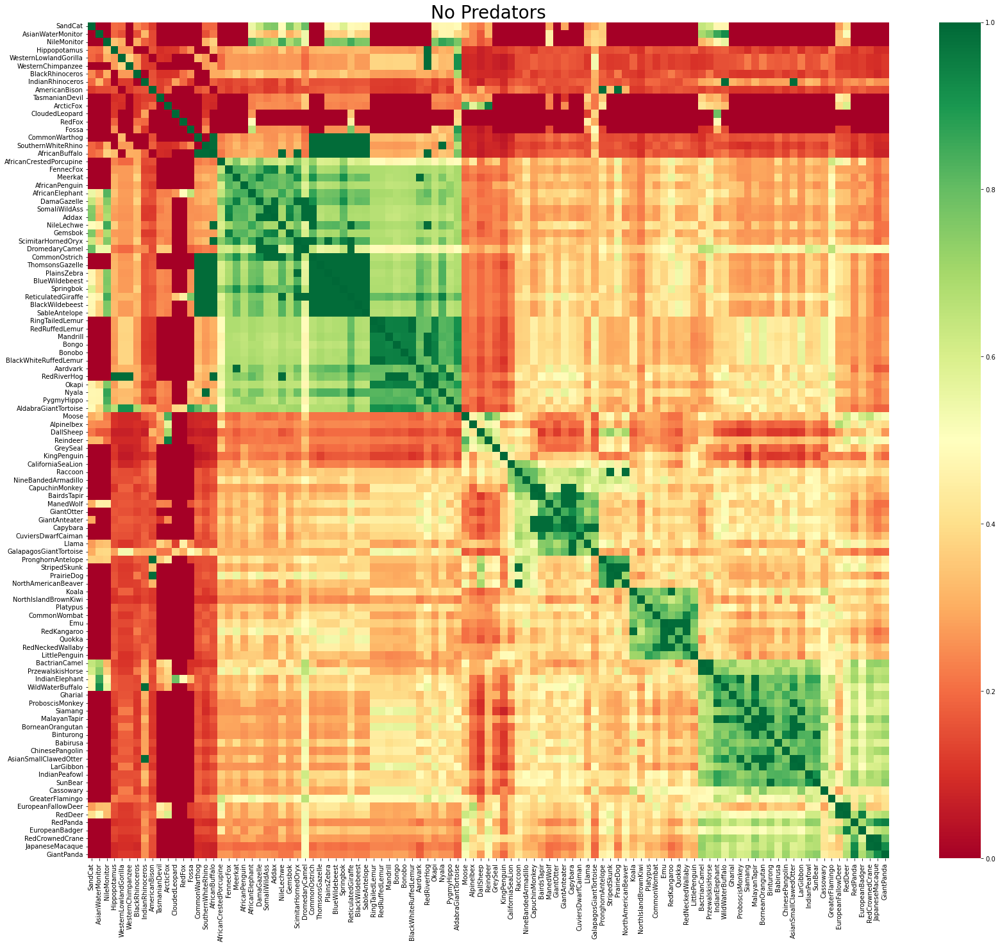
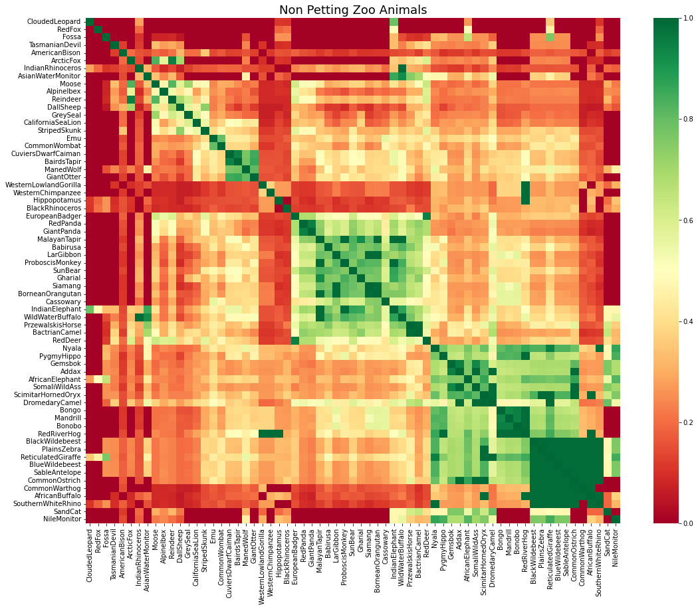
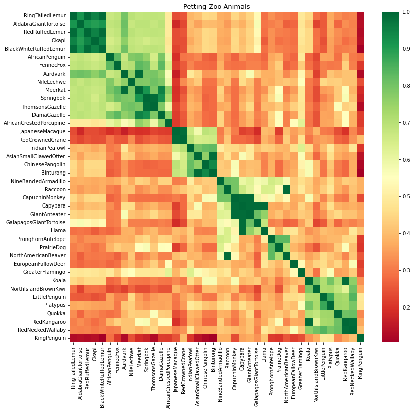
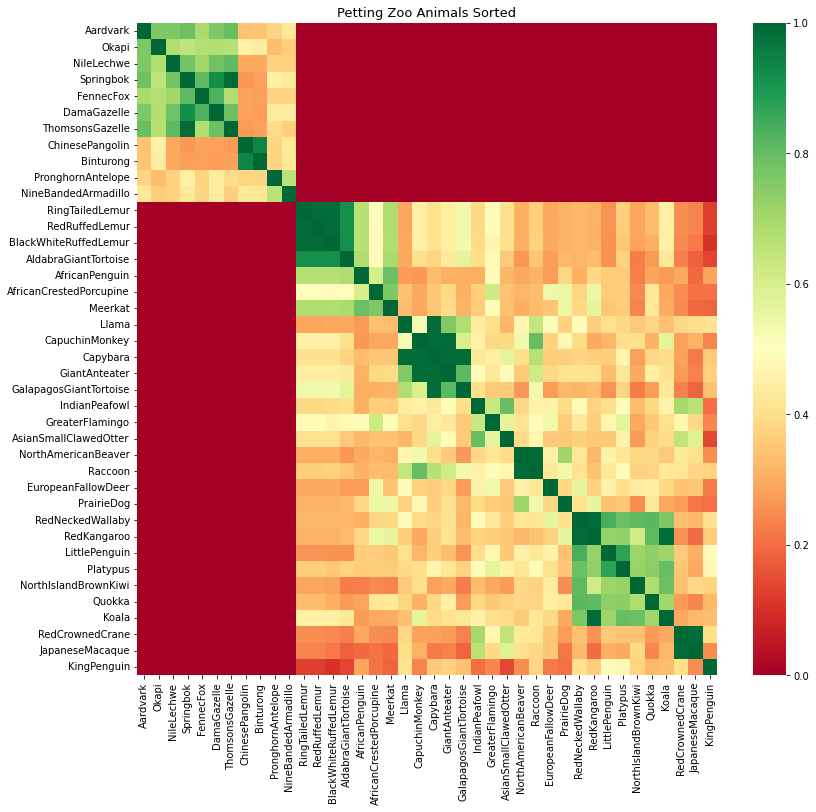

# Planet Zoo - Habitat Compatibility Matrix

The purpose of this repo is to publish the data I used to make the below compatibility maticies for the animals in the video game Planet Zoo.

- **fdb_animals_dataframe.csv** is a comma seperated value (.csv) file that holds data I extracted from the game files with the help of the [Open Naja OVL Tool](https://github.com/OpenNaja/cobra-tools).

- **fdb_animals_compatibility_matrix.csv** is also a .csv file and it holds the results from my calculations.

- **fdb_animals_data_spreadsheet.xlsx** is an excel file that makes it easier to view the other two files.

 

I won't be publishing my code anytime soon because it's a mess and I haven't found the motivation to fix it up yet. ¯\\_(ツ)_/¯

 

---
### Below are the resulting Images using pyplot and seaborn

 

 
 
 
 
 